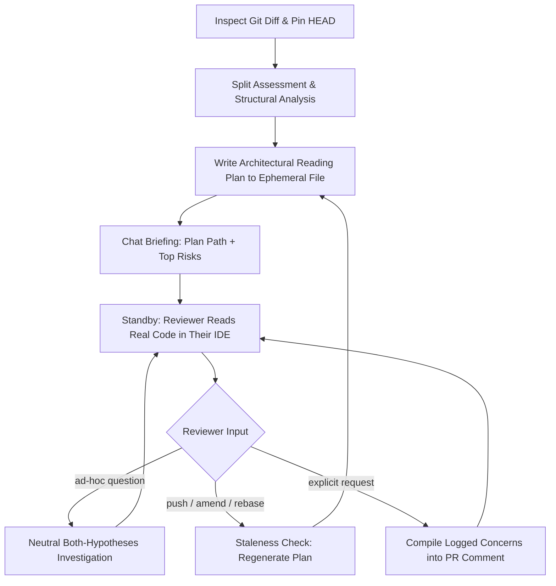

# Review Walkthrough (`review-walkthrough`)

[](https://agentskills.io)
[](../../LICENSE)

An **Architectural Reading Plan Generator and On-Demand Review Co-Pilot** for AI agents, designed to maximize the depth, clarity, and speed of **human** code reviews.

---

## The Problem

Most AI code review tools dump static lints, nitpicks, or a wall of pass/fail badges across an entire diff. When reviewing large or multi-layered pull requests, human reviewers experience:

1. **Diff Fatigue**: Trying to parse 20+ files at once without a coherent reading sequence.
2. **Reviewer Blindness**: Glossing over critical schema or invariant changes buried in the middle of cosmetic updates.
3. **Loss of Context**: Missing the mental model that connects data structures to the downstream UI components.

Interactive chat walkthroughs address part of this but introduce problems of their own: turn-by-turn gating that fights asynchronous review habits, and trimmed code hunks trapped in a chat window — a far worse reading surface than the reviewer's own IDE, where surrounding context is one keystroke away.

## The Solution

`review-walkthrough` acts as an **architectural tour guide, not a gatekeeper**. It analyzes the branch diff once, writes a complete **reading plan** to an ephemeral markdown file, and hands it over: the reviewer opens the plan side-by-side with their native IDE or diff viewer, reads real code at their own pace, and calls on the agent only for emergent questions — answered through neutral, both-hypotheses code investigation.

---

## Key Features

- **One-Shot Reading Plan**: A complete, structured markdown artifact — topological itinerary, risk hypotheses, blind spots — written to an ephemeral, never-git-tracked location, opened side-by-side with your editor.
- **Split Recommendation**: For oversized diffs, the plan opens by stating that splitting the PR is the superior fix and suggests a boundary — then still guides the review for diffs that can't be split.
- **Topological Itinerary**: Foundation-to-leaf reading order (Schemas → Domain Logic → I/O & Workers → UI → Tests) as interactive checkboxes with clickable `file:line` links and a per-slice rationale.
- **Anchored Risk Hypotheses**: 3–5 concrete, line-referenced open questions (concurrency, boundary values, rollback semantics, backward compatibility) — hypotheses to verify, never conclusions.
- **Verification Blind Spots**: What the automated tests cover vs. what requires manual verification.
- **Base Ref Pinning & Staleness Detection**: Pins `HEAD` at plan time and re-checks it during the review, offering to regenerate after a rebase or amend.
- **Progressive Tooling**: Uses graph/structural MCP tools when available; degrades gracefully to git and grep when not — and labels heuristic findings as such.
- **Anti-Bias Q&A**: Emergent questions are investigated under a both-hypotheses mandate (via a neutral research subagent where supported), never by confirming a predetermined answer.
- **Zero Unsolicited Output**: No automatic sign-off recaps or PR comments — logged findings are compiled into a ready-to-post markdown block only on explicit request.

---

## How to Trigger

In any compatible AI assistant (Claude Code, Cursor, OpenCode, Codex, Antigravity), use natural phrases like:

- *"Walk me through the changes on this branch"*
- *"Can you give me a guided code review?"*
- *"Review this PR against main"*
- *"Generate a reading plan for this diff"*

---

## Lifecycle



---

## Installation

### Via Vercel Skills CLI
```bash
# Install directly from GitHub
npx skills add SMhdAsadi/my-skills@review-walkthrough

# Or install globally
npx skills add SMhdAsadi/my-skills@review-walkthrough --global
```

### Manual Installation
Copy or symlink `skills/review-walkthrough` into your agent harness's designated skills folder:

- **Claude Code**: `~/.claude/skills/` or project `.claude/skills/`
- **OpenCode**: `~/.opencode/skills/` or `.opencode/skills/`
- **Antigravity / Gemini CLI**: `~/.gemini/config/skills/`
- **Codex / Generic Agents**: `~/.agents/skills/`

---

## Versioning & Releases

This skill follows [Semantic Versioning](https://semver.org). Every release is:

- tagged in git as `review-walkthrough-v<version>`,
- published with notes on the [GitHub Releases page](https://github.com/SMhdAsadi/my-skills/releases),
- and recorded in [CHANGELOG.md](CHANGELOG.md).

The skills CLI installs the default branch (latest) by default. To pin a specific version, install from the tag URL:

```bash
# Latest (tracks main)
npx skills add SMhdAsadi/my-skills@review-walkthrough

# Pinned to v2.0.0
npx skills add https://github.com/SMhdAsadi/my-skills/tree/review-walkthrough-v2.0.0
```

Note: in `owner/repo@review-walkthrough`, the `@` suffix selects the *skill*, not a version — version pinning is done via the tag URL above. The current version is also recorded in `SKILL.md` under `metadata.version` (informational, per the Agent Skills spec).

---

## File Structure

```
skills/review-walkthrough/
├── SKILL.md                 # Agent instructions (Agent Skills format)
├── README.md                # Human-facing guide (this file)
├── CHANGELOG.md             # Version history (Keep a Changelog)
└── references/
    └── review-rubric.md     # Layering heuristics, risk-hypothesis formulas, investigation templates
```

---

## License

This skill is distributed under the [MIT License](../../LICENSE).
