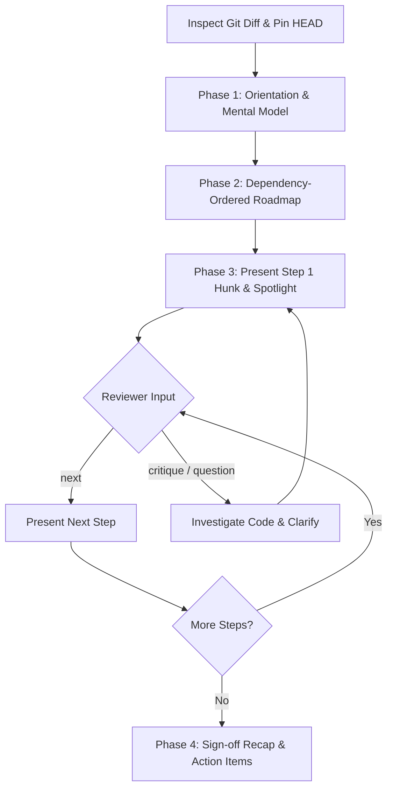

# Review Walkthrough (`review-walkthrough`)

[](https://agentskills.io)
[](../../LICENSE)

An interactive, step-by-step code review companion for AI agents designed to maximize the depth, clarity, and speed of **human** code reviews.

---

## The Problem

Most AI code review tools dump static lints, nitpicks, or a wall of pass/fail badges across an entire diff. When reviewing large or multi-layered pull requests, human reviewers experience:

1. **Diff Fatigue**: Trying to parse 20+ files at once without a coherent reading sequence.
2. **Reviewer Blindness**: Glossing over critical schema or invariant changes buried in the middle of cosmetic updates.
3. **Loss of Context**: Missing the mental model that connects data structures to the downstream UI components.

## The Solution

`review-walkthrough` flips the dynamic: **the agent acts as an architectural tour guide, not an automated gatekeeper**. It pre-digests the diff, establishes a mental model, designs an optimal reading path from foundation to leaf, and walks the human reviewer through one coherent logical slice at a time.

---

## Key Features

- **Base Ref Pinning**: Automatically resolves base branches (`main`, `master`, `develop`) and pins `HEAD` to detect mid-review staleness or rebases.
- **Topological Reading Roadmap**: Automatically sorts files and hunks in **foundation-to-leaf** dependency order:
  1. Schemas, Types, and Migrations
  2. Core Business Logic & State Machines
  3. Side Effects, I/O & API Endpoints
  4. Presentation, Controllers & UI Components
  5. Tests & Tooling
- **Targeted Reviewer Spotlight**: Anchors 2–3 probing questions to exact line numbers and variables in each hunk (e.g., invariants, boundary values, error propagation).
- **Interactive Pacing**: Delivers Step 1 first and waits for reviewer feedback (`next`, `skip`, or questions) before continuing.
- **Sign-off Recap**: Aggregates all concerns, action items, and agreements logged during the interactive turns into a final sign-off checklist.

---

## How to Trigger

In any compatible AI assistant (Claude Code, Cursor, OpenCode, Codex, Antigravity), use natural phrases like:

- *"Walk me through the changes on this branch"*
- *"Can you give me a guided code review?"*
- *"Review this PR step-by-step against main"*
- *"Walk through diff chunk by chunk"*

---

## Interactive Walkthrough Lifecycle



---

## Installation

### Via Vercel Skills CLI
```bash
# Install directly from GitHub
npx skills add SMhdAsadi/my-skills@review-walkthrough

# Or install globally
npx skills add SMhdAsadi/my-skills@review-walkthrough --global
```

### Manual Installation
Copy or symlink `skills/review-walkthrough` into your agent harness's designated skills folder:

- **Claude Code**: `~/.claude/skills/` or project `.claude/skills/`
- **OpenCode**: `~/.opencode/skills/` or `.opencode/skills/`
- **Antigravity / Gemini CLI**: `~/.gemini/config/skills/`
- **Codex / Generic Agents**: `~/.agents/skills/`

---

## File Structure

```
skills/review-walkthrough/
├── SKILL.md                 # Agent instructions (Agent Skills format)
├── README.md                # Human-facing guide (this file)
└── references/
    └── review-rubric.md     # Reference heuristics for layering & spotlight questions
```

---

## License

This skill is distributed under the [MIT License](../../LICENSE).
