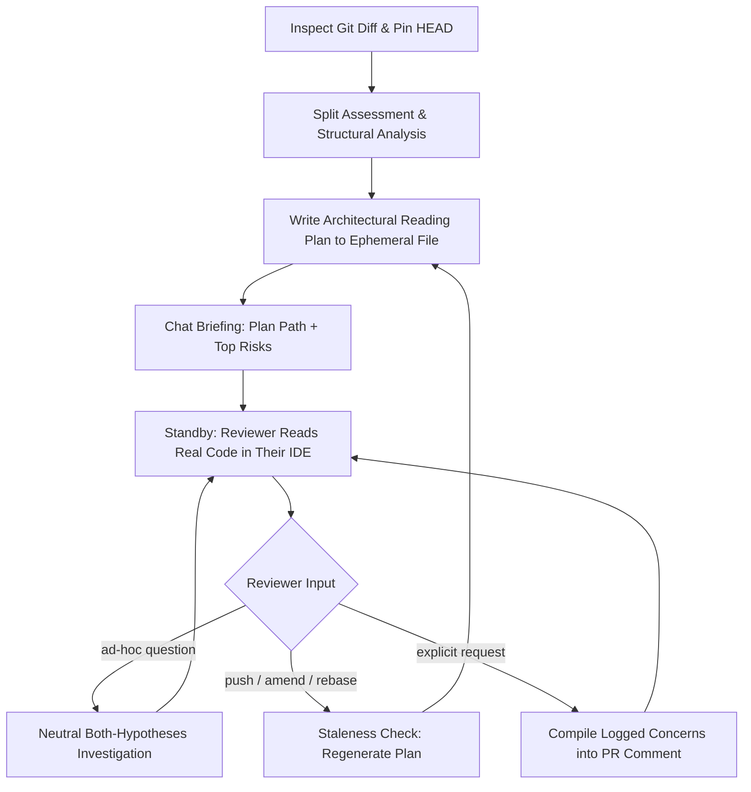

# Review Walkthrough (`review-walkthrough`)

[](https://agentskills.io)
[](../../LICENSE)

An **Anti-Fatigue Review Guide Generator and On-Demand Review Co-Pilot** for AI agents, designed to maximize the depth, clarity, and speed of **human** code reviews.

---

## The Problem

Most AI code review tools dump static lints, nitpicks, or an overwhelming wall of academic text and pass/fail badges across an entire diff. When reviewing pull requests, human reviewers experience:

1. **Reading Fatigue**: Verbose formal reports with academic jargon, disclaimer banners, ASCII diagrams, and multi-row tables that stretch the scrollbar.
2. **Reviewer Blindness**: Glossing over critical gotchas or subtle bugs buried in pages of fluff.
3. **Loss of Flow**: Trying to parse 20+ files at once without a clean, file-grouped reading sequence.

Interactive chat walkthroughs introduce problems of their own: turn-by-turn gating that fights asynchronous review habits, and trimmed code hunks trapped in a chat window — a far worse reading surface than the reviewer's own IDE, where surrounding context is one keystroke away.

## The Solution

`review-walkthrough` acts as a **lean, practical review co-pilot**. It analyzes the branch diff once, writes a compact (~40–60 line) **review guide** to an ephemeral markdown file, and hands it over: the reviewer opens the guide side-by-side with their native IDE or diff viewer, reads real code at their own pace, and calls on the agent only for emergent questions — answered through neutral, both-hypotheses code investigation.

---

## Key Features

- **Lean Review Guide**: A compact, structured markdown artifact (~40–60 lines) written to an ephemeral, never-git-tracked location, opened side-by-side with your editor. Zero fluff, zero academic pretense.
- **Language-Agnostic & Conversational**: Naturally matches the language of your prompt (German, Persian, Spanish, etc.) in a relaxed, punchy peer-to-peer developer voice.
- **Gotchas & Risks Upfront**: 2–4 line-anchored, practical edge cases right below the 2-sentence summary — spotting traps before you dive into the code.
- **File-Grouped Reading Order**: Logical foundation-to-leaf reading sequence grouped by file with clickable links (no fragmented line-by-line bullets or clunky ASCII trees).
- **Split Recommendation**: For oversized diffs, suggests splitting the PR before generating the guide.
- **Base Ref Pinning & Staleness Detection**: Pins `HEAD` at guide generation time and re-checks it during review, offering to regenerate after a rebase or amend.
- **Progressive Tooling**: Uses graph/structural MCP tools when available; degrades gracefully to git and grep when not.
- **Anti-Bias Q&A**: Emergent questions are investigated under a both-hypotheses mandate (via a neutral research subagent where supported), never by confirming a predetermined answer.
- **Zero Unsolicited Output**: No automatic sign-off recaps or PR comments — logged findings are compiled into a ready-to-post markdown block only on explicit request.

---

## How to Trigger

In any compatible AI assistant (Claude Code, Cursor, OpenCode, Codex, Antigravity), use natural phrases like:

- *"Walk me through the changes on this branch"*
- *"Can you give me a guided code review?"*
- *"Review this PR against main"*
- *"Generate a reading plan for this diff"*

---

## Lifecycle


```mermaid
flowchart TD
    A[Inspect Git Diff & Pin HEAD] --> B[Split Assessment & Structural Analysis]
    B --> C[Write Architectural Reading Plan to Ephemeral File]
    C --> D[Chat Briefing: Plan Path + Top Risks]
    D --> E[Standby: Reviewer Reads Real Code in Their IDE]
    E --> F{Reviewer Input}
    F -- "ad-hoc question" --> G[Neutral Both-Hypotheses Investigation]
    G --> E
    F -- "push / amend / rebase" --> H[Staleness Check: Regenerate Plan]
    H --> C
    F -- "explicit request" --> I[Compile Logged Concerns into PR Comment]
    I --> E
```

---

## Installation

### Via Vercel Skills CLI
```bash
# Install directly from GitHub
npx skills add SMhdAsadi/my-skills@review-walkthrough

# Or install globally
npx skills add SMhdAsadi/my-skills@review-walkthrough --global
```

### Manual Installation
Copy or symlink `skills/review-walkthrough` into your agent harness's designated skills folder:

- **Claude Code**: `~/.claude/skills/` or project `.claude/skills/`
- **OpenCode**: `~/.opencode/skills/` or `.opencode/skills/`
- **Antigravity / Gemini CLI**: `~/.gemini/config/skills/`
- **Codex / Generic Agents**: `~/.agents/skills/`

---

## Versioning & Releases

This skill follows [Semantic Versioning](https://semver.org). Every release is:

- tagged in git as `review-walkthrough-v<version>`,
- published with notes on the [GitHub Releases page](https://github.com/SMhdAsadi/my-skills/releases),
- and recorded in [CHANGELOG.md](CHANGELOG.md).

The skills CLI installs the default branch (latest) by default. To pin a specific version, install from the tag URL:

```bash
# Latest (tracks main)
npx skills add SMhdAsadi/my-skills@review-walkthrough

# Pinned to v2.0.0
npx skills add https://github.com/SMhdAsadi/my-skills/tree/review-walkthrough-v2.0.0
```

Note: in `owner/repo@review-walkthrough`, the `@` suffix selects the *skill*, not a version — version pinning is done via the tag URL above. The current version is also recorded in `SKILL.md` under `metadata.version` (informational, per the Agent Skills spec).

---

## File Structure

```
skills/review-walkthrough/
├── SKILL.md                 # Agent instructions (Agent Skills format)
├── README.md                # Human-facing guide (this file)
├── CHANGELOG.md             # Version history (Keep a Changelog)
└── references/
    └── review-rubric.md     # Layering heuristics, risk-hypothesis formulas, investigation templates
```

---

## License

This skill is distributed under the [MIT License](../../LICENSE).
